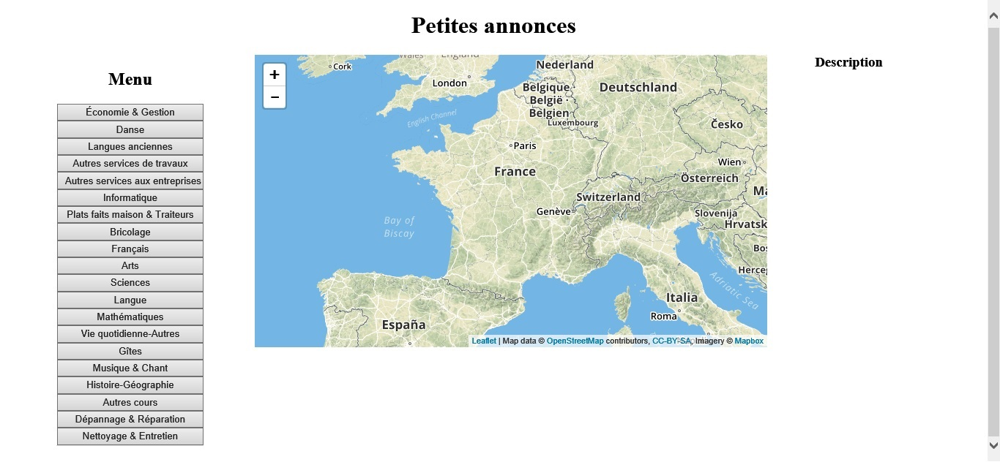
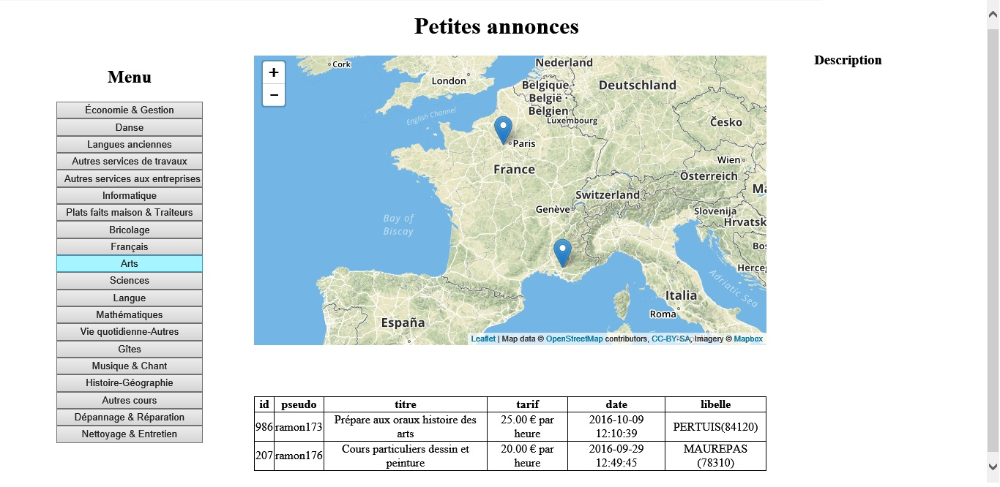
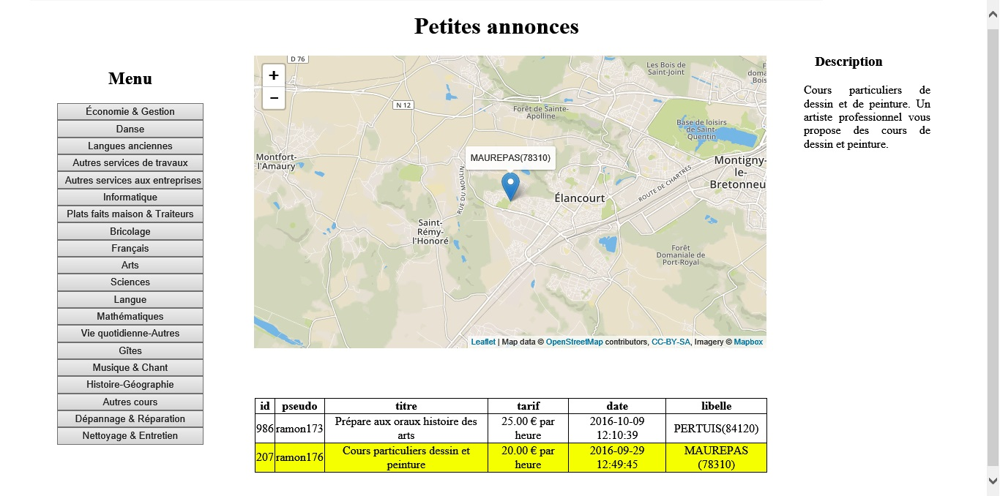

# Petites annonces
## Projet Bases de Données avancées 2017
Le but du projet est d'afficher les détails d'annonces en ligne de manière ordonnée et cartographique et de les manipuler au travers d'une base de données Mongodb.
### Traitement python
Nous disposons de 2 fichiers .csv.
* [annonces.csv](src/annonces.csv)
  * id
  * ?
  * pseudo
  * ?
  * ?
  * titre
  * description
  * tarif
  * unité de temps
  * modalité
  * heure de modification
  * latitude
  * longitude
  * libelé
  * ?
  * ?
* [services.csv](src/annonces.csv)
  * id de ligne de fichier
  * id catégorie
  * id sous-catégorie
  * code sous-catégorie
  * libellé sous-catégorie

#### Algorithme

Après avoir extrait les données des 2 fichiers .csv, on associe à chaque annonce un mot-clé qui précise à quelle sous-catégorie appartient l'annonce. C'est un traitement de text mining effectué sur le titre et la description de l'annonce. Le traitement compte le nombre d'occurence de mots. Ces mots figurent dans un dictionnaire établi de manière arbitraire. Les clefs correspondent aux mots suceptibles d'être rencontrés dans les annonces et leur valeur au sous-catégorie qui caractérisera l'annonce :

```python
dico_services = {'Cours': 'Autres cours', 'devoirs': 'Autres cours', 'BREVET': 'Autres cours', 'COURS': 'Autres cours', 'Enseignante': 'Autres cours', 'Saxophone': 'Musique & Chant', 'maths': 'Mathématiques', 'physique': 'Sciences', 'chimie': 'Sciences', 'sciences': 'Sciences', 'SCOLAIRE': 'Autres cours', 'français': 'Français', 'Mercatique': 'Économie & Gestion', 'Economie': 'Économie & Gestion', 'Droit': 'Autres services de travaux', 'dessin': 'Arts', 'Beaux-Arts': 'Arts', 'langue': 'Langue', 'électronique': 'Informatique', 'informatique': 'Informatique', 'voiture': 'Dépannage & Réparation', 'Maths': 'Mathématiques', 'Physique': 'Sciences', 'Anglais': 'Langue', 'collège': 'Autres cours', 'lycée': 'Autres cours', 'Allemand': 'Langue', 'CP': 'Autres cours', 'CM2': 'Autres cours', 'Collège': 'Autres cours', 'Lycée': 'Autres cours', 'philosophie': 'Autres cours', 'arts': 'Arts', 'MATHS': 'Mathématiques', 'PRIMAIRE': 'Autres cours', 'anglais': 'Langue', 'littérature': 'Autres cours', 'Professeur': 'Autres cours', 'italien': 'Langue', 'grec': 'Langue', 'Grec': 'Langue', 'ANGLAIS': 'Langue', 'chant': 'Musique & Chant', 'danse': 'Danse', 'Gestion': 'Économie & Gestion', 'comptable': 'Économie & Gestion', 'comptabilité': 'Économie & Gestion', 'finance': 'Économie & Gestion', 'gestion': 'Économie & Gestion', 'piano': 'Musique & Chant', 'PHYSIQUE': 'Sciences', 'CHIMIE': 'Sciences', 'SVT': 'Sciences', 'Anglais': 'Langue', 'Italien': 'Langue', 'Economiques': 'Économie & Gestion', 'Sociologie': 'Autres cours', 'Mathématiques': 'Mathématiques', 'FRANÇAIS': 'Français', 'PHILOSOPHIE': 'Autres cours', 'Scolaire': 'Autres cours', 'scolaire': 'Autres cours', 'cours': 'Autres cours', 'espagnol': 'Langue', 'Primaire': 'Autres cours', 'secondaire': 'Autres cours', 'élève': 'Autres cours', 'saxophone': 'Musique & Chant', 'BTS': 'Autres cours', 'FLE': 'Langue', 'espagnol': 'Langue', 'DUT': 'Autres cours', 'littérature': 'Autres cours', 'CHIMIE': 'Sciences', 'TOEFL': 'Langue', 'TOEIC': 'Langue', 'Electronique': 'Informatique', 'Electrotechnique': 'Informatique', 'Mécanique': 'Bricolage', 'Comptabilité': 'Économie & Gestion', 'arabe': 'Langue', 'SES': 'Économie & Gestion', 'histoire': 'Histoire-Géographie', 'géographie': 'Histoire-Géographie', 'MATHÉMATIQUES': 'Mathématiques', 'mathématiques': 'Mathématiques', 'Arabe': 'Langue', 'PHYSIQUES': 'Sciences', 'Plat': 'Plats faits maison & Traiteurs', 'espagnol': 'Langue', 'flûte': 'Musique & Chant', 'PHP': 'Informatique', 'MySQL': 'Informatique', 'HTML': 'Informatique', 'CSS': 'Informatique', 'NTIC': 'Informatique', 'bureautique': 'Informatique', 'internet': 'Informatique', 'économie ': 'Économie & Gestion', 'Informatique': 'Informatique', 'ITALIEN': 'Langue', 'musique': 'Musique & Chant', 'ECJS': 'Autres cours', 'ALLEMAND': 'Langue', 'BIOLOGIE': 'Sciences', 'GEOLOGIE': 'Sciences', 'FRANCAIS': 'Français', 'hébreu': 'Langue', 'PROGRAMMATION': 'Informatique', 'SAXOPHONE': 'Musique & Chant', 'FLÛTE': 'Musique & Chant', 'électricité': 'Informatique', 'salsa': 'Danse', 'bachata': 'Danse', 'chachacha': 'Danse', 'CHINOIS': 'Langue', 'Chant': 'Musique & Chant', 'Piano': 'Musique & Chant', 'chinois': 'Langue', 'CAO': 'Informatique', 'DAO': 'Informatique', 'Graphisme': 'Autres cours', 'MECANIQUE': 'Bricolage', 'solfège': 'Musique & Chant', 'Chinois': 'Langue', 'Economie': 'Économie & Gestion', 'Professeur': 'Autres cours', 'PROFESSEUR': 'Autres cours', 'Géo': 'Histoire-Géographie', 'Histoire': 'Histoire-Géographie', 'CHANT': 'Musique & Chant', 'concours': 'Autres cours', 'CPGE': 'Autres cours', 'guitare': 'Musique & Chant', 'info': 'Informatique', 'Installation': 'Autres services aux entreprises', 'Conseils': 'Autres services aux entreprises', 'Récupération': 'Autres services de travaux', 'latin': 'Langues anciennes', 'Latin': 'Langues anciennes', 'Traductions': 'Autres services aux entreprises', 'ESPAGNOL': 'Langue', 'CHIEN': 'Vie quotidienne-Autres', 'gîte': 'Gîtes', 'ITALIEN': 'Langue', 'CV': 'Autres services aux entreprises', 'Télésecrétaire': 'Autres services aux entreprises', 'service': 'Autres services aux entreprises', 'Service': 'Autres services aux entreprises', 'russe': 'Langue', 'English': 'Langue', 'MATH': 'Mathématiques', 'CONCOURS': 'Autres cours', 'installation': 'Autres services aux entreprises', 'dépannage': 'Dépannage & Réparation', 'investir': 'Investissement & Levée de fond', 'immobilier': 'Autres services de travaux', 'Assistante': 'Autres services aux entreprises', 'Voiture': 'Autres services de travaux', 'location': 'Vie quotidienne-Autres', 'GEOPOLITIQUE': 'Autres cours', 'ECONOMIE': 'Économie & Gestion', 'COMMERCE': 'Économie & Gestion', 'MANAGEMENT': 'Économie & Gestion', 'COLLÈGE': 'Autres cours', 'LYCEE': 'Autres cours', 'Programmeur': 'Informatique', 'INFORMATIQUE': 'Informatique', 'Nettoyage': 'Nettoyage & Entretien', 'Formation': 'Autres cours', 'ordinateur': 'Informatique', 'Webmaster': 'Autres services aux entreprises', 'Conseil': 'Autres services aux entreprises', 'DESSIN': 'Autres cours'}
```

Une fois les annonces associées à une sous-catégorie, on créé un autre dictionnaire lequel sera envoyé à la base de données Mongodb. Le dictionnaire est construit de la manière suivante :

```python
annonce = [id,pseudo,titre,description,tarif,date,lat,long,libelle]
```
```python
{
  catégorie_1:[[annonce_1.1],...,[annonce_1.n]],
  ...,
  catégorie_n:[[annonce_n.1],...,[annonce_n.n]]
}
```
Ce dictionnaire ou JSON, est stocké dans la base de données **services** sous le nom **annonces**.
### Affichage web
#### Prérequis Windows
L'interprétation du fichier .php sur Windows nécessite l'extension **MongoDB PHP Driver on Windows**.
Il faut rajouter dans le fichier **php.ini** la ligne ```extension=php_mongodb.dll``` au bon endroit et placer le bon fichier (téléchargeable d'ici [mongodb](http://pecl.php.net/package/mongodb)) à cette endroit : ```bin\php\phpX.XX.XX\ext```
#### Rendu
On interroge la même base de données Mongodb **services** pour récupérer le document **annonces** et le stocker dans la variable ```$tableau```.
Le menu constitué de bouton est construit en fonction des catégories que contient ce JSON.

La page web est donc constituée d'un menu proposant les catégories, d'une interface cartographique, d'une section décrivant l'annonce et d'un tableau de toutes les annonces d'une catégorie :



La page web nous propose de choisir une catégorie. Ce choix affichera toutes les annonces de cette catégorie plus leur endroit sur la carte :



Ensuite, un simple clic sur une annonce permet de zoomer sur son emplacement géographique et d'afficher sa description.



### Bibliographie

* [Language Processing and Python](http://www.nltk.org/book/ch01.html)
* [Guide de démarrage pour utiliser MongoDb](https://openclassrooms.com/courses/guide-de-demarrage-pour-utiliser-mongodb)
* [Installer MongoDB sur sa Raspberry Pi](https://raspbian-france.fr/installer-mongodb-raspberry-pi/)
* [Leafletjs](http://leafletjs.com/index.html)
* [MongoDB driver](http://php.net/mongodb)
* [Natural Language Toolkit](http://www.nltk.org/)
* [New MongoDB Drivers for PHP and HHVM: Cursor Behaviour](https://derickrethans.nl/new-drivers-part3-cursor.html)
* [Tutorial pymongo](http://api.mongodb.com/python/current/tutorial.html)
